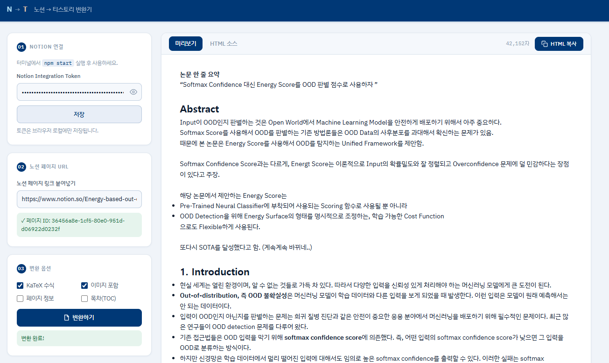

# 노션 → 티스토리 변환기

노션 페이지 URL을 붙여넣으면 티스토리에 바로 붙여넣을 수 있는 HTML로 변환해주는 웹 앱입니다.

LaTeX 수식, 표, 코드 블록, 이미지, 인용구, 토글 등 노션 서식을 티스토리 에디터 포맷(`data-ke-*`)에 맞게 변환합니다.

---

## 주요 기능

- 노션 페이지 URL 붙여넣기 → HTML 즉시 변환
- LaTeX 수식 (`$$...$$`) → 티스토리 MathJax 렌더링
- 표, 코드 블록, 이미지, 인용구, 토글, 구분선 서식 보존
- **Cloudinary 연동 시 이미지 자동 업로드** → 만료되지 않는 영구 URL로 교체
- 페이지 속성(메타 정보) 선택적 추가
- 목차(TOC) 자동 생성 옵션
- 변환된 HTML 원클릭 복사

---

## Overview

<p align="center">
  
</p>

---


## 시작하기

### 1. 저장소 클론 및 설치

```bash
git clone https://github.com/your-username/notion-to-tistory.git
cd notion-to-tistory
npm install
```

### 2. 서버 실행

```bash
npm start
```

브라우저에서 `http://localhost:3000` 접속.

> Node.js 18 이상이 필요합니다.

---

### 3. Notion Integration Token 발급

Notion API를 사용하기 위해 Integration Token이 필요합니다.

1. [Notion My Integrations](https://www.notion.so/my-integrations) 접속
2. **New integration** 클릭
3. 이름 입력 후 생성 → `secret_...` 형태의 토큰 복사
4. 노션에서 변환할 페이지(또는 상위 데이터베이스)에 들어가서 `...` 메뉴 → **Connections** → 방금 만든 integration 추가

---

### 4. Cloudinary 설정 (이미지 자동 업로드 · 선택)

노션 이미지는 S3 임시 URL이라 시간이 지나면 만료됩니다. Cloudinary를 연동하면 변환 시 이미지를 자동으로 Cloudinary에 업로드하여 영구 URL로 교체합니다.

1. [Cloudinary](https://cloudinary.com) 회원가입 (무료 플랜 25GB)
2. 대시보드에서 **Cloud Name**, **API Key**, **API Secret** 확인
3. 앱의 **02 Cloudinary** 섹션에 입력 후 **저장**

> 입력하지 않으면 기존처럼 Notion 원본 URL을 그대로 사용합니다.

---

### 5. 사용 방법

1. 앱에서 Notion Integration Token 입력 후 **저장**
2. (선택) Cloudinary 정보 입력 후 **저장**
3. 변환할 노션 페이지 URL 붙여넣기
4. 변환 옵션 선택 후 **변환하기**
5. 미리보기 확인 후 **HTML 복사**
6. 티스토리 글쓰기 → 우측 상단 `</>` HTML 버튼 클릭 → **붙여넣기**

---

## 파일 구조

```
notion-to-tistory/
├── index.html      # 앱 UI
├── style.css       # 스타일
├── app.js          # 프론트엔드 로직
├── server.js       # Express 서버 (Notion API 프록시 + HTML 변환)
├── package.json    # 의존성 정의
└── README.md
```

---

## 기술 스택

- **Node.js 18+** + **Express** — 로컬 서버 (Notion API CORS 우회)
- **Notion API** (`2022-06-28`) — 페이지 블록 조회
- **Cloudinary API** — 이미지 영구 호스팅 (선택)
- **Vanilla JS** — 프론트엔드 (빌드 불필요)
- **KaTeX** — 미리보기 수식 렌더링 (티스토리 붙여넣기 시에는 MathJax 사용)

---

## 주의사항

- **토큰 및 Cloudinary 키는 브라우저 `localStorage`에만 저장**되며 외부 서버로 전송되지 않습니다.
- Cloudinary를 사용하지 않을 경우, 노션 이미지는 S3 임시 URL이므로 만료 전에 티스토리에 직접 업로드해야 합니다.
- `node_modules`는 공유 시 포함하지 않아도 됩니다. `npm install`로 자동 설치됩니다.

---

## 라이선스

MIT
